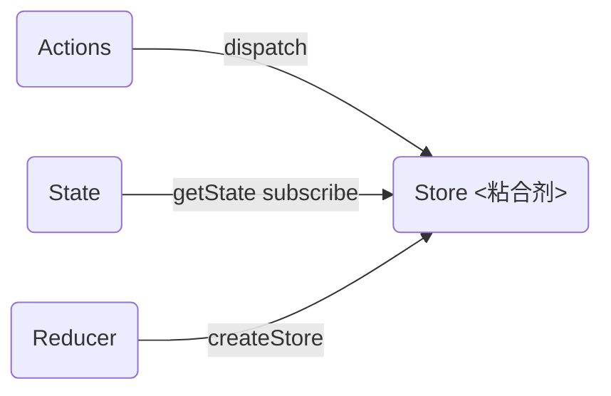
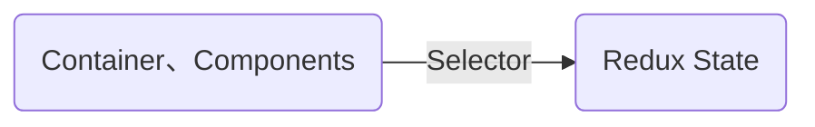
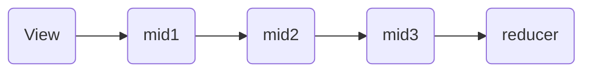
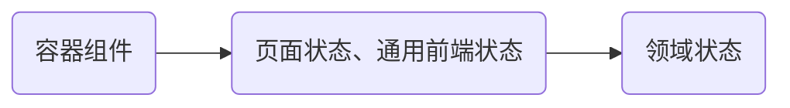

# react+redux慕课网


[toc]

## 第1章 课程介绍

#### vsc插件：

- Prettier

- Reactjs code snippets 自动生成react模板

- Auto Rename Tag

#### 主要依赖库版本：

- React@v16.4.1

- Redux@v4.0.0

- React Redux@v5.0.7

- ReactRouter@v4.3.1

## 第2章 React项目脚手架：create-react-app

打开vscode 的命令面板，安装code命令，安装以后就可以在终端中用vscode打开项目。

> Shell command: install 'code'  command in Path

#### 使用mock数据

1. 使用node起服务作为mock服务器，修改package.json中的"proxy"字段做代理转发。

比如使用node服务器起的mock服务端口是5000，项目的webpack-dev-server的端口是3000，如下配置

```json
"proxy":{    
  "target":{        
    "/api": "http://localhost:5000"
  }
}
```

这样就可以将/api转发到5000的mock服务端口了。

2. 使用create-react-app创建的项目，直接将mock数据放到项目public文件夹

## 第3章 React思维方式：跟着Todo项目学习React思想

### 组件划分原则

- 解耦：降低单一模块/组件的复杂度
- 复用：保证组件一致性，提升开发效率
- 组件颗粒度需要避免过大或过小

### 编写静态组件

- 开发过程解耦：静态页面和动态交互
- 组件开发顺序：自下而上 or 自上而下

### 如何设计State

#### 什么是State

- 代表UI的<font color="red">完整</font>且<font color="red">最小</font>状态集合

#### 如何判断

- 是否通过父组件props传入
- 是否不会随着时间、交互操作变化
- 是否可以通过其他state或props计算得到

#### State的双层含义

- 代表应用UI的所有状态集合
- 状态集合中的每一部分（比如：待办事项列表、新增输入框文本、筛选条件）

#### React事件处理

- 使用JSX语法时需要传入一个函数作为事件处理函数，而不是一个字符串

```javascript
class Toogle extends React.Component{
  constructor(props){
    super(props);
    // 为了在回调中使用`this`,这个绑定是必不可少的
    this.handleClick = this.handleClick.bind(this);
  }
  render() {
    return (
    	<button onClick={this.handleClick}>Toggle</button>
    )
  }
  handleClick() {
    this.setState({})
  }
}
```

Javascript中class方法默认不会绑定this，所以需要谨慎对待JSX回调函数中的this，如果忘记绑定，当调用回调函数时this的值为undefined。

如果觉着使用bind麻烦，有两种替代方法：

```javascript
// 方法1：使用实验性的public class fields语法
class Toggle extends React.Component{
  handleClick = () => {
    this.setState({})
  }
}

// 方法2：在回调中使用箭头函数
class Toggle extends React.Component{
  render() {
    return (
    	<button onClick={(e) => this.handleClick(e)}>Toggle</button>
    )
  }
}

// 注意：方法2一般不会有问题，但如果该回调函数作为prop传入子组件时，这些组件可能会进行额外的重新渲染。通常建议在构造器中绑定或使用class fields语法来避免性能问题。
```

## 第4章 Redux基础：跟着Todo项目学习Redux

### Redux中的State

和react中的state有所不同，react中的state是分散管理的，每个组件都可以有自己的state，而redux中的state是全局只有一个，集中管理的。

- 集中管理，全局唯一
- 不可变性
- 定义方式同React State

### Redux中的Actions

- 描述如何修改状态
- JSON对象，type属性必需
- 发送：store.dispatch


### 创建Store




### react-redux

- 向根组件注入Store -> Provider
- 连接React组件和Redux状态层 -> connect
- 获取React组件所需的State和Actions -> map api


### 展示型组件和容器型组件

|                     |     展示型组件      |           容器型组件           |
| :-----------------: | :-----------------: | :----------------------------: |
|       关注点        |      UI的展现       | 逻辑<br />（取数据、更新状态） |
| 对Redux层是否有感知 |         否          |               是               |
|       读数据        |    从props中获取    |      从Redux store中获取       |
|       写数据        | 调用props传递的回调 |       发送Redux actions        |
|      如何创建       |        书写         |      通过react-redux创建       |

### 异步Action

redux-thunk

```javascript
import {createStore, applyMiddleware} from "redux";
import thunkMiddleware from "redux-thunk";

const store = createStore(rootReducer, applyMiddleware(thunkMiddleware))
```


### Redux调试工具

- 浏览器插件：https://github.com/zalmoxisus/redux-devtools-extension
- 项目依赖库：https://github.com/reduxjs/redux-devtools


## 第5章 Redux 进阶：用好Redux必备

#### Redux项目结构组织方式

- 按照类型
- 按照功能模块
- Ducks

#### 按照类型

```javascript
actions/
  --actions1.js
	--actions2.js

components/
  --components1.js
  --components2.js

reducers/
  --reducer1.js
  --reducre2.js

containers/
  --container1.js
	--container2.js
```


#### 按照功能模块

```javascript
feature1/
  --components/
  --Container.js
	--actions.js
	--reducer.js

feature2/
  --components/
  --Container.js
	--actions.js
	--reducer.js

```


#### Ducks

- Https://github.com/erikras/ducks-modular-redux
- reducers、action types、actions组合到一个文件中，作为独立模块
- 划分模块的依据：应用状态State，而不是界面功能


### State设计原则

#### 常见两种错误

- 以API为设计State的依据
- 以页面UI为设计State的依据

#### 像设计数据库一样设计State

#### 设计数据库基本原则

- 数据按照领域(Domain)分类，存储在不同的表中，不同的表中存储的列数据不能重复。
- 表中每一列的数据都依赖于这张表的主键。
- 表中除了主键以外的其他列，互相之间不能有直接依赖关系。

#### 设计State原则

- 数据按照领域把整个应用的状态按照领域(Domain)分成若干子State，子State之间不能保存重复的数据。
- 表中State以键值对的结构存储数据，以记录的key/ID作为记录的索引，记录中的其他字段都依赖于索引。
- State中不能保存可以通过已有数据计算而来的数据，即State中的字段不互相依赖。


### Selector函数



Components代表的View层和Redux代表的状态层是独立的两个层级，这两个层级的交互应该通过接口的方式去进行通信，而不是通过state的数据结构的形式来通信的。所以View层不应该知道状态层具体的数据结构。Redux代表的状态层应该告诉View层调用某一个方法获取状态。所以Selector函数实现了View层和装状态层的解耦。

### Middleware



```javascript
const logger = ({getState, dispatch}) => next => action => {
  console.group(action.type);
  console.log("dipatch: ", action);
  const result = next(action);
  console.log("next state:", getState());
  console.groupEnd();
  return result;
}

export default logger;
```

```javascript
import loggerMiddleware from "./middleware/logger";
const store = createStore(rootReduer, applyMiddleware(thunkMiddleware, loggerMiddleware));
```


### Store Enhancer

- 增强redux store的功能
- createStore(reduer, [preloadedState], [enhancer])

#### Store Enhancer一般结构

```javascript
function enhancerCreator(){
  return createStore => (...args) => {
    // do something based old store
    // return a new enhanced store
  }
}
```

例如：

```javascript
const logger = createStore => (...args) => {
  const store = createStore(...args);
  const dispatch = (action) => {
    console.group(action.type);
    console.log("dispatching:", action);
    const result = store.dispatch(action);
    console.log("next state:", store.getState());
    console.groupEnd();
    return result;
  }
  return {...store, dispatch}
}
export default logger; 
```

```javascript
import {createStore, applyMiddleware, compose} from "redux";
import loggerEnhancer from "../enhancers/logger";

const store = createStore(rootReducer, compose(applyMiddleware(thunkMiddleware), loggerEnhancer));
```

> 注：applyMiddleware也是一个storeEnhancer


### Store Enhancer和Middleware的关系

- middleware是store enhancer的一种特例

```javascript
function applyMiddleware(...middlewares){
  return createStore => (...args) => {
    return {
      ...store,
      dispatch
    }
  }
}
```


 在日常开发中，应该更多的使用middleware而不是store enhancer，因为middleware是更高层的抽象，而store enhancer是一个比较低层次的抽象，通过store enhancer不仅可以增强dispatch，还可以增强store的其他方法，比如getState，subscribe。middleware相当于做了约束，不会改动到store的其他地方。日常中慎用store enhancer。

### Immutable.js

- API
  - Immutable.fromJS()
  - .toJS()
  - state.get
  - state.getIn  嵌套对象逐层获取，state.getIn(["todos", "data"])获取到{todos:{data: ""}}中的data数据
  - state.merge
  - state.set
  - state.push
- 简化操作不可变对象和提高效率

```javascript
import Immutable from "immutable";

const reducer = (state = Immutable.fromJS(initialState), action) => {
  switch (action.type) {
    case "FETCH_TODOS_REQUEST":
      return state.set("isFetching", true);
    case "FETCH_TODOS_SUCCESS":
      return state.merge({
        isFetching: false,
        data: Immutable.fromJS(action.data)
      });
    case "FETCH_TODOS_FAILURE":
      return state.merge({
        isFetching: false,
        error: action.error
      });
    default:
      const data = state.get("data");
      return state.set("data", todos(data, action));
  }
};
```


```javascript
const mapStateToProps = state => ({
  todos: getVisibleTodos(state).toJS() // 如果没有toJS()的话，容器连接的组件props传入的就是immutable类型的数据
})
```

当redux的store发生改变的时候，每一个容器型组件中的mapStateToProps都会被重新执行。redux会根据mapStateToProps中的todos是否发生改变去决定是否重新渲染容器连接的视图组件。因为Immutable的toJS()无论state是否发生改变，都会返回新的对象，所以总是会重新渲染，所以要改变Immutable的使用方式。

用高阶组件去做

```javascript
/HOCs/toJS.js
import {connect} from "react-redux";
import TodoList from "../components/TodoList";
import {toggleTodo, fetchTodos} from "../actions";

const mapStateToProps = state => ({
  todos: state.todos.data,
})

const mapDispatchToProps = dispatch => ({
  toggleTodo: id => dispatch(toggleTodo(id)),
  fetchTodos: () => dispatch(fetchTodos())
});

export default connect(mapStateToProps, mapDispatchToProps)(TodoList);
```

### Reselect

- 减少state的重复计算
- API
  - createSelector
  - defaultMemoize
  - createSelectorCreator
  - createStructuredSelector
- 只有当select函数很复杂，整个redux项目性能较差的时候再考虑引入使用reselect。


## 第6章 React Router 4：全新的React组件式的动态路由库

### React Router 相关库

- react-router
- react-router-dom
- react-router-native

### \<Router>

- \<BrowserRouter>
  - HTML5 history API（pushState，replaceState等）
  - 需要Web服务器额外配置
- \<HashRouter>
  - 使用url的hash部分作为路由信息
  - 主要为了兼容老版本浏览器

### \<Route>

- path

- 一般情况下，\<Router>中的所有的\<Route>只要路径符合都会被渲染

- match

  - ```javascript
    class User extends Component{
      render() {
        const {match} = this.props;
        return (
        	<div>
          	User: {match.params.user}
          </div>
        )
      }
    }
    ```

### 路由匹配

- exact：只有路径完全相同的时候才会匹配渲染
- \<Switch>：只会去匹配第一个匹配到的\<Route>


### \<Route>渲染组件方式

- \<Route component={() =>  \<Home />}>
  - 如果使用内联函数component传入组件的方式，调用React.createElement()方法调用新的组件，这样每次调用都会卸载组件然后再装载组件，会导致组件内部状态丢失。
- \<Route render={(props) => \<About  {...props}/>}>
  - 使用内联函数传入的组件不会被重复的卸载，装载。组件内的状态可以在不同的render之间保存下来
  - props中注入了match等参数
- \<Route children={}>
  - 执行机制和render 的执行机制相似，接收一个函数作为值，props作为参数。
  - 和render的区别在于props.match。当使用children的时候，无论路径是否匹配成功，Route里的内容都会被渲染，但区别在于如果匹配成功，props.match是存在的；如果匹配不成功，则不存在。


## 第7章 大众点评前端架构设计

### 前端工程化

- 可控：脚手架、开发规范等
- 高效：框架、组件库、Mock平台、构建部署工具等


### 基本规范

- 目录结构
- 构建体系
- Mock数据


#### 目录结构

```javascript
-src
|-utils
|
|-images
|
|-redux
|     |-middleware
|			|-modules
|
|-components   // 全局通用的展示型组件
|
|-containers   // 容器型组件
			|
  		|-App
			|  |-index.js
  		|	 |-style.css
      |
  		|-Home
  		|	 |-components			// Home容器型组件自己的展示型组件
  		|	 |		|
  		|	 |
  		|	 |-index.js
    	|	 |-style.css
```


### 抽象1：状态模块定义

- 商品、店铺、订单、评论  ->领域状态
- 各页面UI状态
- 前端基础状态：登录态、全局异常信息


#### Redux模块分层



### 抽象2：网络请求层

- 常规使用方式
- 使用redux中间件封装

redux中间件middleware对请求封装


### 抽象3：通用错误处理

- 错误信息组件
- 错误状态


## 第8章 首页开发


## 第9章 团购详情页开发


## 第10章 搜索页开发


## 第11章 搜索结果页开发


## 第12章 登录页开发


## 第13章 个人中心开发


## 第14章 购买功能开发


## 第15章 项目优化、构建和部署

### 性能优化：组件按需加载

dynamic import()

import("../pathToComponent")


## 第16章 课程总结


